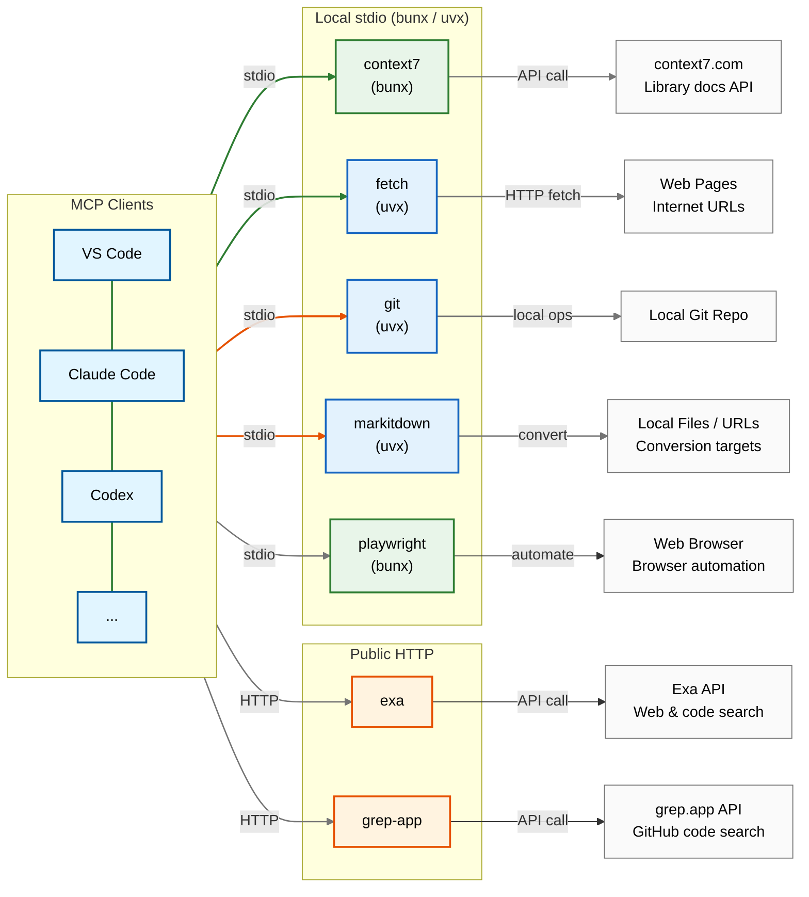

# mcp-compose-bundle

[한국어](README.md)

A bundle for configuring MCP (Model Context Protocol) servers using
**bunx/uvx (stdio)** and **public HTTP** endpoints.
Edit only `config.yaml` — client-specific config files are auto-generated.

## :rocket: Quick Start

```sh
# Initialize submodule (includes guidelines folder)
git submodule update --init --recursive

# Generate config files
./generate-configs.sh
```

## :wrench: Configuration Management

This project uses a **single YAML-based configuration system**:

- **Master config**: `config.yaml` (edit this file only)
- **Generated files**: `claude.json`, `copilot.json`, `codex.toml`, `opencode.json` (auto-generated)

### Generate Configs

```bash
# Generate all client config files
./generate-configs.sh
```

## :wrench: Prerequisites

Install the following tools before using local stdio MCP servers:

```sh
# Install bun and uv via asdf (recommended)
asdf plugin add bun
asdf plugin add uv
asdf install bun latest
asdf install uv latest
asdf set --home bun latest
asdf set --home uv latest
```

> **Note**: `bunx` runs npm packages without installing them globally,
> and `uvx` runs Python packages without installing them globally.
> We recommend using [asdf](https://asdf-vm.com/) for version management.

## :package: Included MCP Servers

### Local stdio Servers (bunx / uvx)

Downloaded and executed automatically via `bunx` or `uvx` — no manual installation required:

| Server | Runner | Command | Description |
|---|---|---|---|
| context7 | bunx | `@upstash/context7-mcp@latest` | Up-to-date library docs and code examples |
| fetch | uvx | `mcp-server-fetch` | Fetch URL page content (ignores robots.txt) |
| git | uvx | `mcp-server-git` | Git repository operations and automation |
| markitdown | uvx | `markitdown-mcp` | Convert various documents to Markdown |
| playwright | bunx | `@playwright/mcp@latest` | Browser automation |

### Public HTTP Servers (Hosted)

Publicly hosted HTTP MCP servers. Connect directly via HTTP URL without installation:

| Service | URL | Description |
|---|---|---|
| exa | https://mcp.exa.ai/mcp | AI-powered web search, code search, research tools |
| grep-app | https://mcp.grep.app | Search code across public GitHub repositories |

## :wrench: Notes

### Disabling servers in JSON configs

`claude.json` / `copilot.json` are JSON, so you can't comment out entries.
To disable a server, remove its entry from the file.
(For Codex `codex.toml`, you can use `enabled = true/false`.)

### `fetch` MCP server (robots.txt bypass)

`mcp-server-fetch` obeys robots.txt by default.
Add `--ignore-robots-txt` to the `args` list to disable this behavior.

- Upstream: [mcp-server-fetch][fetch-upstream]

## :triangular_ruler: Client Config Samples

- VS Code: see [`copilot.json`](./copilot.json)
- Codex CLI: see [`codex.toml`](./codex.toml)
- Claude Code: see [`claude.json`](./claude.json)
- OpenCode: see [`opencode.json`](./opencode.json)

## :card_file_box: Project Structure

```text
mcp-compose-bundle/
├── config.yaml               # Master config file (edit this only)
├── generate-configs.sh        # Config generation script
├── claude.json                # Claude Code MCP config (auto-generated)
├── copilot.json               # VS Code Copilot MCP config (auto-generated)
├── codex.toml                 # Codex CLI MCP config (auto-generated)
├── opencode.json              # OpenCode MCP config (auto-generated)
├── .gitmodules                # Git submodule configuration
├── .github/workflows/         # GitHub Actions (guidelines submodule update)
└── guidelines/                # Git submodule: agent guidelines
```

## :memo: Architecture (high level)



### MCP Server Classification

| Type | Servers | Execution Method |
|---|---|---|
| Web/Network | context7, fetch, playwright | bunx / uvx (stdio) |
| Utilities | markitdown | uvx (stdio) |
| Dev Tools | git | uvx (stdio) |
| Search | exa, grep-app | Public HTTP |

**Connection Types**:

- **Orange arrows**: HTTP (publicly hosted)
- **Green arrows**: stdio (local bunx/uvx)

[fetch-upstream]: https://github.com/modelcontextprotocol/servers/tree/main/src/fetch
