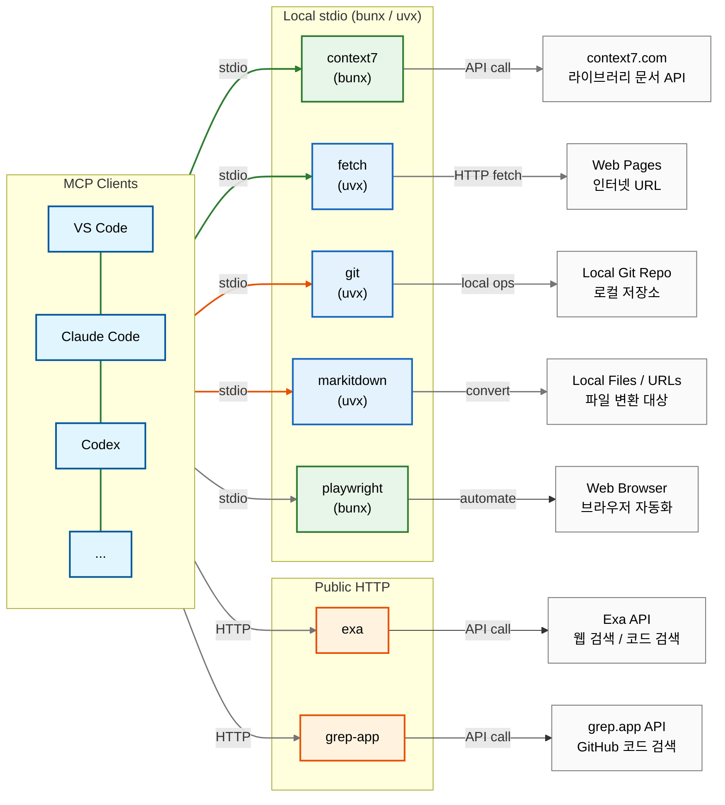

# mcp-compose-bundle

[English](README.en.md)

MCP(Model Context Protocol) 서버들을 **bunx/uvx(stdio)** 및 **공개 HTTP** 방식으로
한 번에 구성하는 번들입니다.
`config.yaml` 하나만 편집하면 여러 클라이언트용 설정 파일이 자동 생성됩니다.

## :rocket: Quick Start

```sh
# Submodule 초기화 (guidelines 폴더 포함)
git submodule update --init --recursive

# 구성 파일 생성
./generate-configs.sh
```

## :wrench: Configuration Management

이 프로젝트는 **YAML 기반의 단일 구성 관리 시스템**을 사용합니다:

- **마스터 구성 파일**: `config.yaml` (이 파일만 편집하세요)
- **생성된 파일**: `claude.json`, `copilot.json`, `codex.toml`, `opencode.json` (자동 생성됨)

### 구성 생성

```bash
# 모든 클라이언트 구성 파일 생성
./generate-configs.sh
```

## :wrench: Prerequisites

로컬 stdio MCP 서버를 사용하기 전에 다음 도구를 설치해야 합니다:

```sh
# asdf로 bun, uv 설치 (권장)
asdf plugin add bun
asdf plugin add uv
asdf install bun latest
asdf install uv latest
asdf set --home bun latest
asdf set --home uv latest
```

> **Note**: `bunx`는 npm 패키지를 설치 없이 실행하는 도구이고,
> `uvx`는 Python 패키지를 설치 없이 실행하는 도구입니다.
> 버전 관리를 위해 [asdf](https://asdf-vm.com/)를 통한 설치를 권장합니다.

## :package: Included MCP Servers

### Local stdio Servers (bunx / uvx)

별도 설치 없이 `bunx` 또는 `uvx`를 통해 자동으로 다운로드 및 실행됩니다:

| Server | Runner | Command | Description |
|---|---|---|---|
| context7 | bunx | `@upstash/context7-mcp@latest` | 라이브러리 최신 문서 및 코드 예제 검색 |
| fetch | uvx | `mcp-server-fetch` | URL 페이지 콘텐츠 가져오기 (robots.txt 무시) |
| git | uvx | `mcp-server-git` | Git 저장소 조작 및 자동화 |
| markitdown | uvx | `markitdown-mcp` | 다양한 문서를 Markdown으로 변환 |
| playwright | bunx | `@playwright/mcp@latest` | 브라우저 자동화 |

### Public HTTP Servers (Hosted)

공개 호스팅되는 HTTP MCP 서버들입니다. 별도 설치 없이 HTTP URL로 직접 연결합니다:

| Service | URL | Description |
|---|---|---|
| exa | https://mcp.exa.ai/mcp | AI 기반 웹 검색, 코드 검색, 리서치 도구 |
| grep-app | https://mcp.grep.app | 공개 GitHub 저장소에서 코드 검색 |

## :wrench: Notes

### JSON config에서 비활성화

`claude.json` / `copilot.json`은 JSON이라 주석 처리가 불가능합니다.
특정 서버를 끌려면 해당 서버 엔트리를 **삭제**하는 방식으로 관리하세요.
(`codex.toml`은 `enabled = true/false`로 토글 가능)

### `fetch` MCP server (robots.txt bypass)

`mcp-server-fetch`는 기본적으로 robots.txt를 따릅니다.
`--ignore-robots-txt`를 `args`에 추가하면 비활성화할 수 있습니다.

- Upstream: [mcp-server-fetch][fetch-upstream]

## :triangular_ruler: Client Config Samples

- VS Code: see [`copilot.json`](./copilot.json)
- Codex CLI: see [`codex.toml`](./codex.toml)
- Claude Code: see [`claude.json`](./claude.json)
- OpenCode: see [`opencode.json`](./opencode.json)

## :card_file_box: Project Structure

```text
mcp-compose-bundle/
├── config.yaml               # 마스터 구성 파일 (이것만 편집)
├── generate-configs.sh        # 구성 파일 생성 스크립트
├── claude.json                # Claude Code MCP 설정 (자동 생성)
├── copilot.json               # VS Code Copilot MCP 설정 (자동 생성)
├── codex.toml                 # Codex CLI MCP 설정 (자동 생성)
├── opencode.json              # OpenCode MCP 설정 (자동 생성)
├── .gitmodules                # Git submodule 설정
├── .github/workflows/         # GitHub Actions (guidelines submodule 업데이트)
└── guidelines/                # Git submodule: 에이전트 가이드라인
```

## :memo: Architecture (high level)



### MCP Server Classification

| Type | Servers | 실행 방식 |
|---|---|---|
| Web/Network | context7, fetch, playwright | bunx / uvx (stdio) |
| Utilities | markitdown | uvx (stdio) |
| Dev Tools | git | uvx (stdio) |
| Search | exa, grep-app | Public HTTP |

**Connection Type**:

- **Orange arrows**: HTTP (공개 호스팅)
- **Green arrows**: stdio (로컬 bunx/uvx)

[fetch-upstream]: https://github.com/modelcontextprotocol/servers/tree/main/src/fetch
