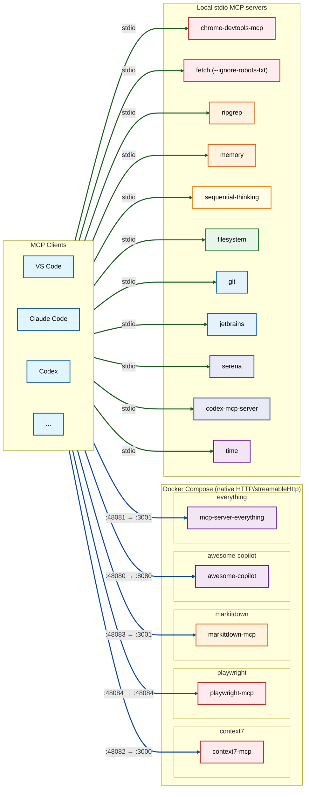

# mcp-compose-bundle

[English](README.en.md)

Docker Compose로 **native HTTP / streamableHttp**
Model Context Protocol (MCP) 서버들을 한 번에 띄우는 번들입니다.
HTTP를 지원하지 않는 서버는 **로컬 stdio**로 실행하도록 샘플 설정
(`mcp.json`, `claude.json`, `config.toml`)을 제공합니다.

## :rocket: Quick Start

```sh
docker compose up -d
docker compose up -d awesome-copilot everything context7
docker compose logs -f
docker compose down
```

## :package: Included MCP Servers

### Docker Services (HTTP/streamableHttp)

| Service         | Port  | Description                            |
|-----------------|-------|----------------------------------------|
| awesome-copilot | 48080 | Copilot chat modes, collections        |
| context7        | 48082 | Library docs from Context7             |
| everything      | 48081 | MCP test server                        |
| markitdown      | 48083 | Converts docs to Markdown              |
| playwright      | 48084 | Browser automation                     |

### Local stdio Servers (no Docker)

로컬 stdio 서버들은 [`mcp.json`](./mcp.json)에 설정되어 있습니다.

- **filesystem**: local file system operations
- **git**: Git operations on your local repo
- **serena**: semantic code analysis via local language servers
- **fetch**: fetches URLs from the internet (supports robots.txt bypass)

## :wrench: Notes

### JSON config에서 비활성화

`mcp.json` / `claude.json`은 JSON이라 주석 처리가 불가능합니다.
특정 서버를 끌려면 해당 서버 엔트리를 **삭제**하는 방식으로 관리하세요.
(`config.toml`은 `enabled = true/false`로 토글 가능)

### `fetch` MCP server (robots.txt bypass)

`mcp-server-fetch`는 기본적으로 robots.txt를 따릅니다.
`--ignore-robots-txt`를 `args`에 추가하면 비활성화할 수 있습니다.

- Upstream: [mcp-server-fetch][fetch-upstream]

### Serena context selection

Serena는 실행 시점에 `--context <name>`으로 toolset을 조정합니다.
가장 최신 정의/설명은 공식 문서와 context YAML을 확인하세요.

- [Serena Docs][serena-docs]
- Context YAMLs:
  - [claude-code.yml][serena-claude]
  - [ide.yml][serena-ide]
  - [codex.yml][serena-codex]

## :gear: JetBrains MCP setup

JetBrains IDE MCP(stdio)는 GitHub Copilot MCP stdio bundle jar가 필요합니다.
`command = "sh"`로 감싸 `$HOME` 기반 경로를 사용합니다.

- [MCP stdio bundle][jetbrains-bundle]

## :triangular_ruler: Client Config Samples

- VS Code: see [`mcp.json`](./mcp.json)
- Codex CLI: see [`config.toml`](./config.toml)
- Claude Code: see [`claude.json`](./claude.json)

## :card_file_box: Project Structure

```text
mcp-compose-bundle/
├── claude.json
├── mcp.json
├── config.toml
├── docker-compose.yaml
└── dockerfiles/
```

## :memo: Architecture (high level)



> :bulb: **Port mapping**: `host:container`
> (e.g., `48080→8080` means host port 48080 maps to container port 8080).
> Only servers that are **native HTTP/streamableHttp** are kept in Docker.

### MCP Server Classification by Type

| Color  | Type          | Servers                                      |
|--------|---------------|----------------------------------------------|
| Red    | Web/Network   | Context7, Playwright, Fetch, Chrome DevTools |
| Orange | Utilities     | MarkItDown, Ripgrep, Memory                  |
| Yellow | AI/Thinking   | Sequential Thinking                          |
| Green  | File System   | Filesystem                                   |
| Blue   | Dev Tools     | Git, JetBrains                               |
| Indigo | Code Analysis | Serena, Codex MCP Server                     |
| Purple | Meta/Testing  | Awesome GitHub Copilot, Everything, Time     |

**Connection Type Colors**:

- **Blue arrows**: HTTP/streamableHttp (Docker)
- **Green arrows**: stdio (local)

[fetch-upstream]: https://github.com/modelcontextprotocol/servers/tree/main/src/fetch
[serena-docs]: https://oraios.github.io/serena/02-usage/050_configuration.html
[serena-claude]: https://raw.githubusercontent.com/oraios/serena/main/src/serena/resources/config/contexts/claude-code.yml
[serena-ide]: https://raw.githubusercontent.com/oraios/serena/main/src/serena/resources/config/contexts/ide.yml
[serena-codex]: https://raw.githubusercontent.com/oraios/serena/main/src/serena/resources/config/contexts/codex.yml
[jetbrains-bundle]: https://github.com/ririnto/mcpserver-stdio-bundle
